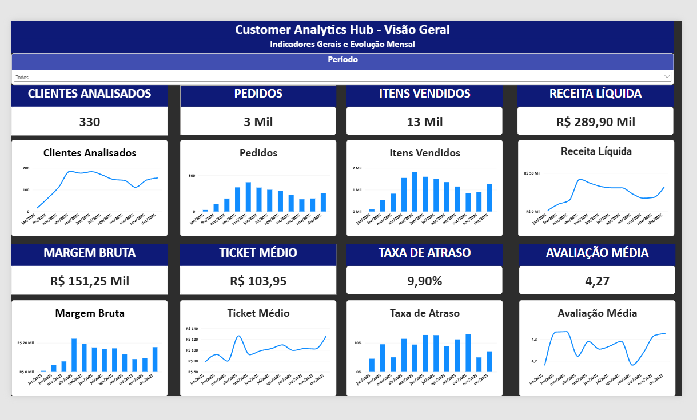

# Customer Analytics Hub

Projeto de engenharia, arquitetura e análise de dados desenvolvido para demonstrar a construção completa de uma solução analítica, desde a avaliação técnica da fonte até a produção de análises orientadas às necessidades do negócio.

## Status do projeto

**Em desenvolvimento.**

Etapa atual: EDA geral sobre o modelo dimensional Gold e construção do dashboard no Power BI.

As etapas técnicas 1 a 12 possuem evidências materiais e documentação retroativa. As etapas SQL permanecem sujeitas à execução e validação no ambiente local.

## Dashboard — Visão Geral

O dashboard foi desenvolvido no Power BI para apresentar os principais indicadores do Customer Analytics Hub e sua evolução mensal.



### Indicadores apresentados

* Clientes analisados
* Pedidos
* Itens vendidos
* Receita líquida
* Margem bruta
* Ticket médio
* Taxa de atraso
* Avaliação média

O relatório possui segmentação por período e utiliza medidas DAX conectadas ao modelo dimensional da camada Gold no SQL Server.

O arquivo do relatório está disponível em:

```text
power_bi/eda_geral/Customer_Analytics_Hub_EDA_Geral.pbix
```

## Objetivo

Construir um pipeline de dados reproduzível e documentado, utilizando apenas os dados-base do dataset Food Commerce Digital Twin.

Dimensões, tabelas-fato, métricas, indicadores e análises são construídos durante o projeto. As estruturas analíticas existentes no arquivo original não são utilizadas como entrada do pipeline.

Cada decisão deverá responder:

* O que foi feito?
* Por que foi necessário?
* Como foi implementado?
* Qual evidência sustentou a decisão?
* Qual foi o custo técnico e operacional?
* Como o resultado foi validado?
* Qual é a interpretação do resultado?

## Fonte de dados

A fonte selecionada é a aba `25_bronze_transactions_sujo`, presente no arquivo:

```text
FOOD_COMMERCE_DIGITAL_TWIN_v3_DADOS_SUJOS_INTENCIONAIS.xlsx
```

O arquivo completo é preservado no Azure Data Lake Storage Gen2. Os dados pesados não são armazenados neste repositório.

## Arquitetura de armazenamento

O projeto utiliza arquitetura em camadas no Azure Data Lake Storage Gen2:

* `00_landing`: recebimento e preservação imutável do arquivo original;
* `01_bronze`: dados brutos ingeridos, sem correções de negócio e acompanhados de rastreabilidade;
* `02_silver`: dados tipados, limpos, normalizados, validados e armazenados em Parquet;
* `03_gold`: fatos, dimensões, métricas governadas e conjuntos prontos para análise;
* `04_exports`: arquivos preparados para ferramentas e consumidores externos;
* `metadata`: manifestos de ingestão, hashes, parâmetros e informações de rastreabilidade;
* `quarantine`: registros rejeitados pelas regras de qualidade, preservados para investigação.

## Estratégia de processamento

Os dados são recebidos em lote. O processamento principal é realizado localmente com Python, Pandas e PyArrow.

Essa decisão considera:

* Volumetria compatível com processamento local;
* Ausência de necessidade de baixa latência;
* Redução de custos recorrentes de computação em nuvem;
* Menor complexidade operacional;
* Manutenção do Azure como camada de armazenamento.

Apache Spark e Spark SQL poderão ser implementados posteriormente como alternativas de escalabilidade, desde que exista justificativa técnica.

## Etapas metodológicas

### 1. Fundação técnica

Preparação do repositório, ambiente de desenvolvimento, segurança, versionamento, dependências e conectividade.

### 2. EDA técnica da camada Bronze

Investigação da estrutura e da qualidade da fonte antes de qualquer limpeza:

* Linhas e colunas;
* Tipos inferidos;
* Granularidade aparente;
* Chaves candidatas;
* Nulidade;
* Duplicidades;
* Cardinalidade;
* Domínios categóricos;
* Datas e horários;
* Valores monetários;
* Valores negativos ou impossíveis;
* Coerência entre colunas;
* Repetição de atributos;
* Integridade entre eventos;
* Campos básicos e calculados.

### 3. Contrato de dados

Definição de nomes canônicos, tipos esperados, domínios, regras de nulidade, chaves, critérios de validação e tratamentos previstos.

### 4. Normalização e camada Silver

Padronização dos valores, separação das entidades canônicas, deduplicação, tipagem, rastreabilidade e gravação em Parquet.

### 5. Validação da camada Silver

Testes de unicidade, completude, validade, consistência, integridade referencial e reconciliação entre Bronze e Silver.

### 6. Modelagem dimensional Gold

Construção das dimensões e tabelas-fato utilizadas pelas diferentes áreas analíticas.

O modelo Gold contém:

* 10 dimensões;
* 4 tabelas-fato;
* Chaves substitutas;
* Relacionamentos dimensionais;
* Métricas compartilhadas;
* Estruturas preparadas para SQL Server e Power BI.

### 7. EDA analítica geral

Investigação dos principais indicadores e de sua evolução temporal sobre o modelo dimensional aprovado.

A EDA geral fornece uma visão consolidada antes do desenvolvimento das análises específicas das áreas de negócio.

### 8. Análises por domínio

As análises serão desenvolvidas na seguinte sequência:

1. Comercial;
2. Financeiro;
3. Logística;
4. Marketing.

Todas as áreas reutilizarão as mesmas dimensões, tabelas-fato e definições canônicas de métricas, evitando divergências entre resultados.

## Modelo dimensional

O Power BI utiliza relacionamentos do tipo muitos para um entre as tabelas-fato e as dimensões.

A direção de filtro é predominantemente única, partindo das dimensões para os fatos, preservando a estrutura de esquema estrela.

Não são utilizados relacionamentos diretos entre tabelas-fato.

## Medidas DAX

As principais medidas criadas no Power BI são:

* Clientes analisados;
* Pedidos;
* Itens vendidos;
* Receita líquida;
* Ticket médio;
* Margem bruta;
* Avaliação média;
* Taxa de atraso.

As medidas são mantidas em uma tabela dedicada chamada `00_Medidas`, facilitando organização, governança e reutilização.

## Governança de métricas

Cada métrica possui uma definição canônica contendo:

* Fórmula;
* Granularidade;
* Fontes;
* Filtros;
* Tratamento de nulos;
* Período;
* Unidade;
* Arredondamento;
* Versão.

As diferentes áreas podem analisar perspectivas distintas, mas utilizam as mesmas definições para receita, valor bruto, valor líquido, custos, margem e demais indicadores compartilhados.

Essa abordagem reduz o risco de indicadores com o mesmo nome apresentarem resultados diferentes em cada área.

## Segurança

Não são versionados:

* Dados brutos ou pesados;
* Arquivos Parquet;
* Credenciais;
* Tokens;
* Connection strings;
* Arquivos `.env`;
* Logs reais;
* Ambientes virtuais;
* Arquivos temporários;
* Resultados intermediários não selecionados para publicação.

O arquivo `.env.example` documenta apenas os nomes das variáveis necessárias, sem valores sensíveis.

## Reprodutibilidade

O projeto documenta:

* Versão do Python;
* Dependências;
* Variáveis de ambiente;
* Ordem de execução;
* Entradas e saídas;
* Contratos de dados;
* Testes;
* Decisões arquiteturais;
* Critérios de aprovação de cada etapa.

## Tecnologias utilizadas

* Python
* Pandas
* NumPy
* PyArrow
* SQL Server
* T-SQL
* Azure Data Lake Storage Gen2
* Git
* GitHub
* Power BI
* Power Query
* DAX

Tecnologias adicionais serão incorporadas somente quando resolverem uma necessidade identificada.

## Repositório Snippets

Os códigos específicos e necessários para reproduzir este projeto permanecem neste repositório.

Versões genéricas e reutilizáveis de funções Python e consultas SQL serão publicadas separadamente no repositório Snippets.

## Orquestração e documentação automática

O orquestrador principal executa as etapas Python em sequência e pode, por configuração, carregar o SQL Server e executar os arquivos SQL.

Azure, SQL e documentação são controlados no arquivo `.env`:

```text
ENABLE_AZURE_PUBLISH=false
ENABLE_SQL_SERVER_LOAD=false
ENABLE_SQL_PIPELINE=false
REQUIRE_DOCUMENTATION=true
```

Com o Azure desabilitado, o processamento local não é bloqueado por autenticação externa.

Com `REQUIRE_DOCUMENTATION=true`, uma etapa somente é aprovada depois da geração e validação de seu documento de rastreabilidade.

### Execução completa configurada

```powershell
python .\src\orchestration\run_pipeline_bronze_v3.py
```

### Documentação retroativa

```powershell
python .\src\documentation\documentation_agent.py --retroactive
```

O provedor documental padrão é `deterministic`, gratuito e sem dependência de API.

Opcionalmente, `DOCUMENTATION_PROVIDER=ollama` habilita a síntese com inteligência artificial executada localmente, mantendo evidências e aprovação sob regras determinísticas.

## Domínios analíticos

A EDA geral e as análises comercial, financeira, logística e de marketing reutilizam as mesmas 10 dimensões, 4 tabelas-fato e definições canônicas de métricas.

A configuração dos domínios está disponível em:

```text
configs/analysis_domains.json
```

As definições das métricas estão disponíveis em:

```text
docs/governance/metrics_catalog.md
```

## Exportação segura

Para gerar um arquivo ZIP sem `.env`, `.venv`, `.git`, dados e artefatos locais, execute:

```powershell
.\scripts\export_project_safe.ps1
```

## Próximas etapas

* Consolidar a documentação da EDA geral;
* Validar os indicadores entre SQL Server e Power BI;
* Desenvolver a análise comercial;
* Desenvolver a análise financeira;
* Desenvolver a análise logística;
* Desenvolver a análise de marketing;
* Produzir o relatório técnico completo;
* Produzir a apresentação executiva;
* Publicar os resultados selecionados no GitHub, LinkedIn e site de portfólio.
